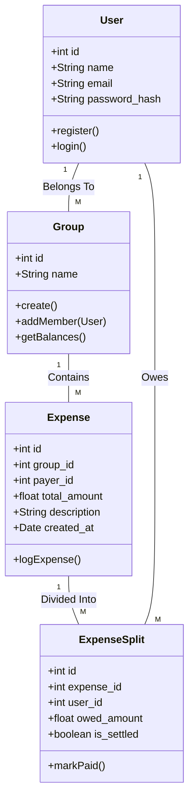

# SplitEase: Design Documentation

## 1. System Architecture
SplitEase utilizes a traditional **Client-Server Architecture**. 
- **Client (Frontend)**: Developed entirely in HTML5, CSS3, and Vanilla JavaScript operating directly within the user's web browser. It is responsible for routing logic between DOM views and firing asynchronous HTTP (Fetch) requests to the PHP Application Programming Interface (API).
- **Server (Backend API)**: A lightweight, custom REST API crafted in native PHP running on a standard Apache HTTP server (e.g., via XAMPP). The state is authenticated via PHP sessions, and JSON responses are sent back to the client.
- **Database Layer**: A relational MySQL database used for persistent persistence of all registered users, expense groups, transactions, and group members.

## 2. System Components & Dependencies
- **User Authentication Component**: Manages secure password hashing, PHP Session storage, and login tokens.
- **Ledger Engine Component**: The core PHP logic calculating debts dynamically. Rather than keeping hard-coded balance tallies in the database, the engine aggregates all positive and negative balance records within a group each time the dashboard loads.
- **Dependencies**: No external 3rd party frameworks (e.g. no React, no Laravel) are used. The only dependency is a functional PHP execution environment (PHP 8.x + MySQL).

## 3. Data Flows
**Logging a New Expense Data Flow:**
1. User enters $100 expense for "Groceries" on the Client interface.
2. JavaScript intercepts the form submit and serializes the JSON object: `{ amount: 100, payer_id: 2, group_id: 1, split_type: 'equal' }`.
3. Client fires HTTP POST request to `/api/expenses.php`.
4. PHP Server decodes JSON and validates that user is part of the group.
5. PHP calculates that the $100 expense is split evenly among 4 members ($25 each).
6. PHP writes one parent record to `expenses` and four sub-records to `expense_splits`.
7. PHP returns `{ success: true }`.
8. Client refreshes the balance display dynamically.

## 4. UI Wireframes
**Dashboard View Wireframe**
```text
------------------------------------------------------
| SplitEase Logo     [Dash] [Groups] [Logout]        |
------------------------------------------------------
|  [ + New Group ]                                  |
|                                                    |
|  [ Trip to Montreal ]     -> You Owe: $25.00       |
|  [ Apartment Expenses]    -> You Are Owed: $100.00 |
------------------------------------------------------
```

**Inside a Group View Wireframe**
```text
------------------------------------------------------
| < Back    Group: Apartment Expenses                |
------------------------------------------------------
|  [ Add Expense ]  [ View Balances ] [ Settle Debt ]|
|                                                    |
|  Recent Expenses:                                  |
|  - Groceries: $100 (Paid by John)                  |
|  - Internet: $60 (Paid by Jane)                    |
------------------------------------------------------
```

## 5. UML Class Diagram (Mermaid)
*(Note: To view this UML diagram properly outside of VS Code, ensure you export your Markdown using a markdown-to-pdf plugin, or paste the snippet into [Mermaid Live Editor](https://mermaid.live)*)


