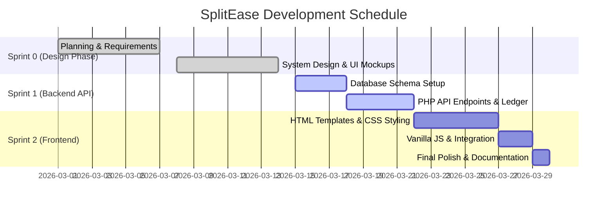

# SplitEase: Project Gantt Chart

The following is a representation of our 4-week Agile schedule broken into Sprints.

*(Note: Ensure you export your Markdown using a markdown-to-pdf plugin, or paste the snippet into [Mermaid Live Editor](https://mermaid.live) to render the exact chart)*

