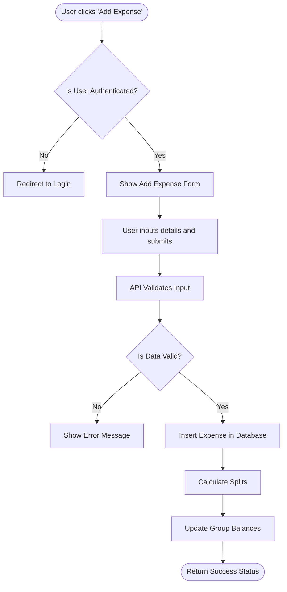
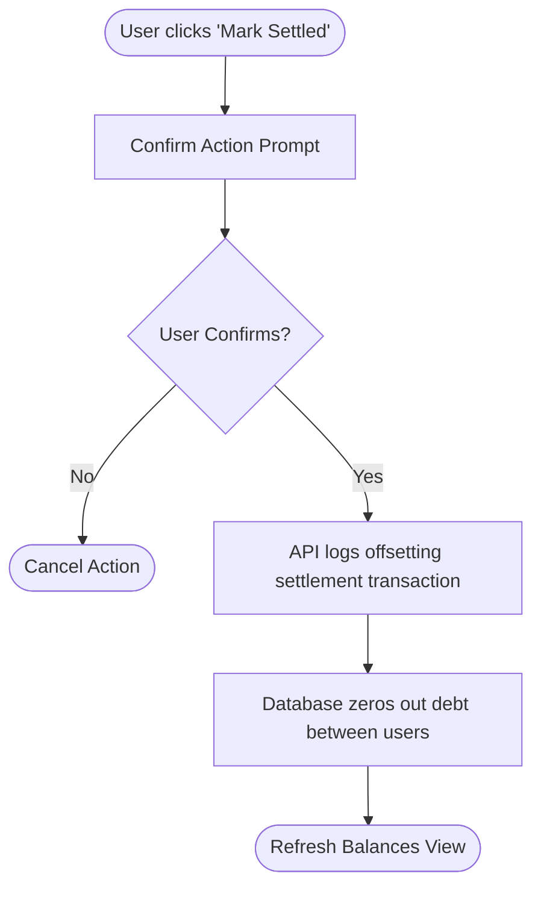

# SplitEase: Requirements Documentation

## 1. Functional Requirements
1. **User Authentication**: Users must be able to securely register with a name, email, and password. Logins must use secure session management.
2. **Group Management**: Users must be able to create "Cost Bunches" (Groups) and invite varying members.
3. **Expense Logging**: A user must be able to enter a new expense containing: Description, Total Amount, Payer, and the Group involved.
4. **Expense Splitting**: The application must allow an expense to be split evenly among all group members by default.
5. **Balance Tracking / Ledger**: The application must calculate an ongoing ledger of balances for each user within a specific group, outputting aggregate "Who owes Whom" metrics.
6. **Debt Settlement**: Users must be able to mark a documented debt to another peer as "Paid / Settled".

## 2. Non-Functional Requirements
1. **Usability**: The app must remain accessible from modern web browsers (Chrome, Firefox, Safari, Edge) without needing extra plugins.
2. **Performance**: API requests should be processed in under 1 second locally to ensure a snappy user experience.
3. **Security**: Passwords must be hashed using robust algorithms (e.g., bcrypt) before database insertion.
4. **Availability**: The system targets high availability by avoiding dependency on third-party public API resources down to the core layout logic.

## 3. Use Cases
**Use Case 1: Add a Group Expense**
- **Actor**: Any registered User.
- **Goal**: Record a new expense so the cost can be split.
- **Flow**: User navigates to Group Dashboard -> Clicks "Add Expense" -> Fills in total amount, description -> Submits -> System updates group balances.

**Use Case 2: Settle Debt**
- **Actor**: User with negative balance.
- **Goal**: Clear an owed amount.
- **Flow**: User views "Balances" tab -> Clicks "Mark Paid" next to a debt -> System calculates reduction and updates ledger -> Debt disappears or balance zeros out.

## 4. UML Activity Diagrams (Mermaid)

### Process: Adding an Expense

### Process: Settle Debt

